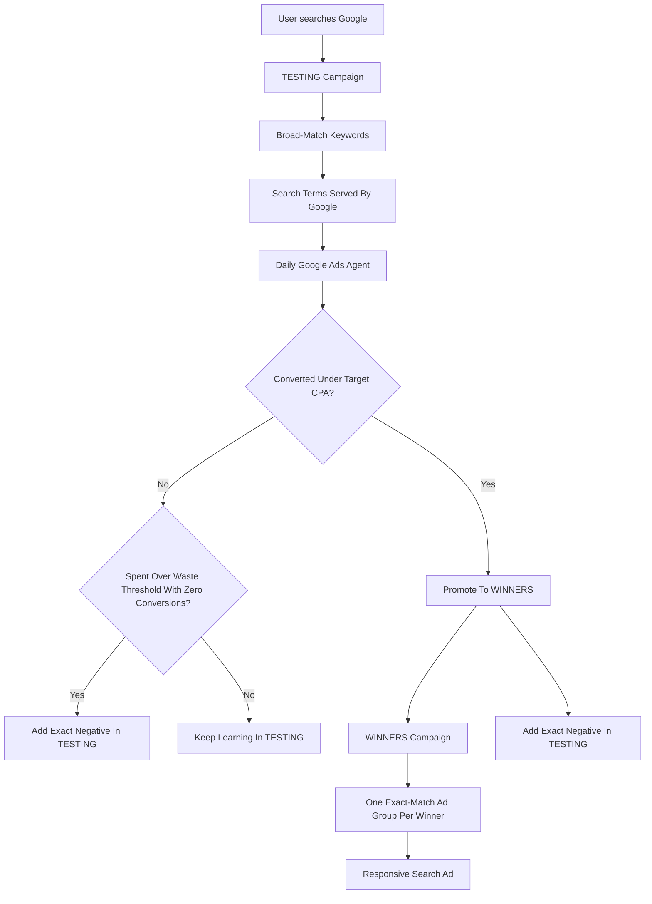
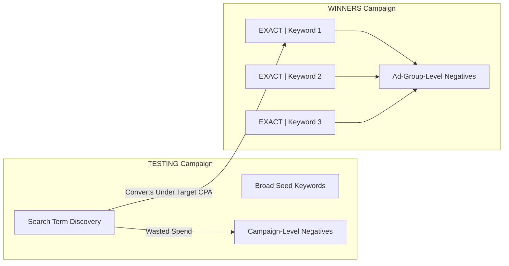

# Google Ads Automation Flow

This document explains how the Google Ads automation works for a client account.
The system manages a repeatable Search campaign loop:

- `TESTING` discovers new search terms using broad-match keywords.
- `WINNERS` harvests proven search terms using exact-match ad groups.
- The daily agent moves good terms forward, blocks wasted terms, and keeps exact-match ad groups clean.

## High-Level Flow



## Daily Agent Run

The scheduled agent runs once per day for each client:

```bash
npm run daily -- --client CLIENT_KEY --auto-apply
```

Example:

```bash
npm run daily -- --client conduit --auto-apply
```

Each run writes a log folder:

```text
runs/<client>/<timestamp>/
```

The log folder contains:

- `winners.json` — converting search terms that meet the target CPA.
- `waste.json` — search terms that spent too much without converting.
- `prune.json` — close variants in WINNERS that should be blocked.
- `summary.json` — counts and whether writes were applied.

## What The Agent Changes

### 1. Promotes Winning Search Terms

When a search term converts at or below the configured target CPA, the agent promotes it.

Example winner:

```text
wealth management crm automation
```

The agent creates this structure:

```text
WINNERS Campaign
└── Ad Group: EXACT | wealth management crm automation
    ├── Keyword: wealth management crm automation
    └── Responsive Search Ad
```

The keyword is added as an exact-match positive keyword in the new WINNERS ad group.

### 2. Stops TESTING From Re-Spending On Winners

After promotion, the same search term is added as an exact-match negative in the TESTING campaign.

```text
TESTING Campaign
└── Negative Keyword: wealth management crm automation
```

This prevents TESTING from continuing to spend on a term that already graduated to WINNERS.

### 3. Blocks Wasted Spend

If a search term spends more than the configured waste threshold and has zero conversions, the agent adds it as an exact-match negative in TESTING.

Example:

```text
Search term: free crm spreadsheet
Spend: $18
Conversions: 0
Waste threshold: $10
```

Result:

```text
TESTING Campaign
└── Negative Keyword: free crm spreadsheet
```

### 4. Prunes WINNERS Close Variants

Google exact match can still serve close variants. The agent checks each WINNERS ad group and blocks search terms that are not the ad group’s target keyword.

Example:

```text
Ad Group: EXACT | wealth management crm automation
Target Keyword: wealth management crm automation
Served Search Term: crm automation jobs
```

Result:

```text
WINNERS Ad Group
└── Negative Keyword: crm automation jobs
```

This keeps each WINNERS ad group focused on its exact target phrase.

## Campaign Structure



## Client Configuration

Each client has a config file:

```text
clients/<client>.json
```

The config controls:

- Google Ads account IDs.
- TESTING campaign ID and name.
- WINNERS campaign ID and name.
- Target CPA threshold.
- Waste spend threshold.
- Lookback window.
- Landing page URL.
- Default responsive search ad copy.

Google Search headlines are limited to 30 characters. When the agent creates a
promoted winner ad, it automatically fits the keyword headline and brand headline
inside that limit before sending the ad to Google.

Example:

```json
{
  "client_key": "conduit",
  "display_name": "Conduit",
  "google_ads": {
    "customer_id": "CLIENT_ACCOUNT_ID",
    "login_customer_id": "MCC_ACCOUNT_ID"
  },
  "campaigns": {
    "testing_campaign_id": "TESTING_CAMPAIGN_ID",
    "testing_campaign_name": "graphed_testing",
    "testing_ad_group_id": "TESTING_AD_GROUP_ID",
    "winners_campaign_id": "WINNERS_CAMPAIGN_ID",
    "winners_campaign_name": "graphed_winners"
  },
  "thresholds": {
    "target_cpa": 150,
    "waste_min_spend": 25,
    "lookback_days": 30
  },
  "promotion": {
    "landing_page_url": "https://www.helloconduit.com/",
    "brand_headline": "Conduit Dock & Yard",
    "descriptions": [
      "Replace spreadsheets and phone calls with online dock scheduling. Book a demo today.",
      "Carrier self-booking, driver check-in, and real-time yard visibility in one platform."
    ]
  }
}
```

## Safeguards

The unattended daily run includes safeguards:

- It skips winners that already have a WINNERS ad group.
- It skips winners already negated in TESTING.
- It dedupes waste negatives before writing.
- It dedupes WINNERS ad group negatives before writing.
- It logs every run to a timestamped folder.
- It fails loudly on config, auth, or Google Ads API errors.

## What The Client Should Expect

Over time, the TESTING campaign should continue discovering search demand, while the WINNERS campaign becomes a clean set of exact-match ad groups for proven terms.

The system is designed to:

- Reduce wasted spend from bad search terms.
- Move converting search terms into a cleaner campaign structure.
- Keep WINNERS ad groups focused on their target phrases.
- Produce a daily audit trail of what the agent found and changed.

